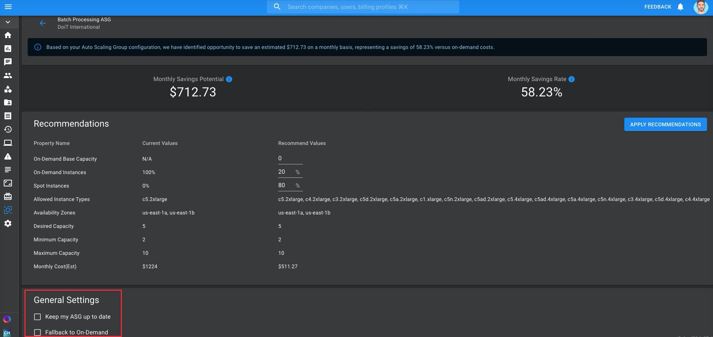
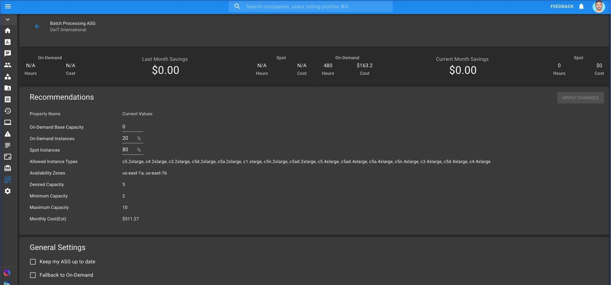

.. _spot-scaling_spot-scaling-setup:

Setting Up Spot Scaling
=======================

Connect your AWS Accounts
-------------------------

To use Spot Scaling, you must provide access to your AWS account(s) to the CMP. `Read this article <https://help.doit-intl.com/amazon-web-services/add-your-amazon-web-services-iam-role>`__ to see how to link your AWS account(s).

.. ATTENTION::

   If you've already linked your AWS account(s) to the CMP, go to this step instead.

As part of linking your account, you will need to create an AWS IAM Role and attach an IAM Policy to it containing a requisite set of permissions. These permissions allow Spot Scaling to function — monitor your ASG behavior, make spot instance recommendations, and allow you to implement them from the CMP

In the same article linked above, read the section on `how to create a policy for Spot Scaling <https://help.doit-intl.com/amazon-web-services/add-your-amazon-web-services-iam-role#spot-scaling>`__ with the requisite permissions.

AWS Account previously linked
^^^^^^^^^^^^^^^^^^^^^^^^^^^^^

If your account was already linked prior to enabling Spot Scaling functionality, you need to update the role attached to the account with the additional requisite permissions for Spot Scaling**.

**Follow** `these instructions <https://help.doit-intl.com/amazon-web-services/add-your-amazon-web-services-iam-role#adding-a-feature>`__ **on adding a feature to an already-linked AWS account**. Be sure to check the box next to "Spot Scaling", as shown below.

.. image:: ../_assets/image\ (69).png
   :alt: A screenshot showing the checkbox next to the _Spot Scaling_ option

Implement Spot Scaling Recommendations
--------------------------------------

View Recommendations
^^^^^^^^^^^^^^^^^^^^

To navigate to your Spot Scaling recommendations, click on the Spot Scaling icon in your lefthand navigation panel.

.. image:: ../_assets/cleanshot-2021-06-22-at-13.44.17.jpg
   :alt: A screenshot showing the location of the _Spot Scaling_ menu item

Once an AWS account is linked, any Auto Scaling Groups (ASGs) associated with it which aren't optimized will appear in your Spot Scaling page.

These ASGs will have a value of "Not Optimized" under the "Optimization Status" column.

.. image:: ../_assets/spotscalingnotoptimized.jpg
   :alt: A screenshot showing the _Optimization Status_ column

Click on the ASG to view its SpotScaling recommendation.

.. image:: ../_assets/spotscaling-click-asg.jpg
   :alt: A screenshot showing the _ASG_ link

Your ASG's current configuration is displayed under the "Current Values" column. Spot Scaling's recommendations are displayed under the "Recommended Values" column.

Additional Spot Scaling Settings
^^^^^^^^^^^^^^^^^^^^^^^^^^^^^^^^

With Spot Scaling you have two additional options you can select when optimizing your ASG's configuration:

* **Keep my ASG up to date**: If turned on, Spot Scaling will automatically update the ASG's configuration to continuously maximize system runtime and spot-related EC2 savings.
* **Fallback to On-Demand**: When there aren't where enough unused EC2 instances to meet demand for Spot instances, Spot Scaling will automatically fallback to on-demand instances.

Apply Recommendations
^^^^^^^^^^^^^^^^^^^^^

Examine the recommendations and, if the proposed changes seem satisfactory with you, click on **APPLY RECOMMENDATIONS** to reconfigure your ASG according to Spot Scaling's recommendations.

.. image:: ../_assets/spotscalingapplyrec.jpg
   :alt: A screenshot showing the location of the _Apply Recommendations_ button

If you want to tweak the recommendation, you may also modify the values under the following rows before applying it:

* On-Demand Base Capacity
* On-Demand Instances
* Spot Instances

Once you've applied the recommendation, the "Recommended Values" column will disappear.

The values under the "Current Values" column will update, reflecting the changes you made when applying the recommendation.

Additionally, after applying a recommendation, your ASG will have a value of "Optimized" under the "Optimization Status" column.

.. image:: ../_assets/spotscalingnowoptimized.jpg
   :alt: A screenshot showing an _Optimized_ status under the _Optimization Status_ column
