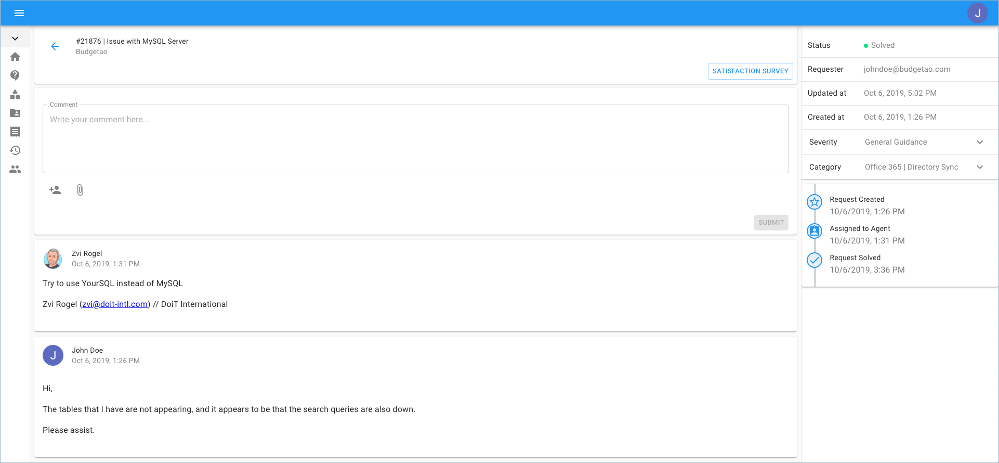

.. _tickets_access-an-existing-support-request:

Working with Support Requests
=============================

If you would like to access and review previously submitted support requests, you can easily do so through the Cloud Management Platform (i.e., `https://hello.doit-intl.com <https://hello.doit-intl.com/>`__).

From the main dashboard please select '**Access Support**'.

.. image:: ../_assets/new-access-support\ (1).png
   :alt: A screenshot showing the _Access Support_ section

Another way to access the 'Support' page is by clicking on the icon on the left-hand side of the page.

.. image:: ../_assets/support-tab\ (1).png
   :alt: A screenshot showing the location of the _Support_ menu item

You can locate tickets that are currently 'In Progress', and by enabling the 'Show Closed Tickets' finder, see the archived tickets.

.. image:: ../_assets/existing-tickets\ (1).png
   :alt: A screenshot showing a list of tickets

By clicking on 'View Ticket', you are brought to a new page which includes the full description and in-depth details where you are able to comment, escalate, solve, and more.

