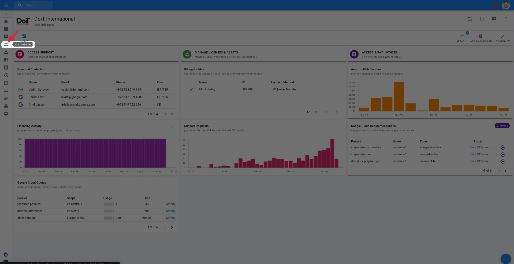
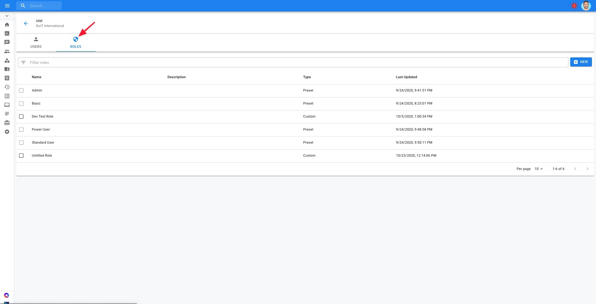

.. _user-management_manage-roles:

Manage Roles
============

.. epigraph::

   User Roles allow you to group sets of permissions and assign them to the users in your organization.

If you don't want to give a user full access to the Cloud Management Platform, you can let them perform only a subset of tasks by assigning a role. Roles make it easy to assign multiple permissions and manage users more efficiently in your organization.

.. NOTE::

   Required permission to manage and assign roles: **User Manager**

.. WARNING::

   Prior to Roles, CMP users were manually assigned permissions. These legacy permissions are forward-compatible, so you will not lose access to any functionalities you previously had access to.

Pre-built roles
---------------

There are a few pre-built roles in your account for your convenience. The easiest way to give user privileges is to assign pre-built roles. Each role grants one or more privileges that together, allow performing a common business function. For example, one role allows managing user accounts, another role manages financial aspects, another role manages IT functions, and so on.

Basic Role
^^^^^^^^^^

.. list-table::
   :header-rows: 1

   * - Privileges
     - Only users with privilege can:
   * - Support
     - create new and access existing technical support requests

IT Manager
^^^^^^^^^^

.. list-table::
   :header-rows: 1

   * - Privileges
     - Only users with privilege can:
   * - Support
     - create new and access existing technical support requests
   * - Issues Viewer
     - Access to cloud outage information
   * - Assets Manager
     - view and manage assets, including managing licenses

Finance User
^^^^^^^^^^^^

.. list-table::
   :header-rows: 1

   * - Privileges
     - Only users with privilege can:
   * - Support
     - create new and access existing technical support requests
   * - Billing Profiles Admin
     - create new and manage existing billing profiles, including payment method
   * - Invoice Viewer
     - access invoices
   * - Cloud Analytics
     - create new and access existing :doc:`Cloud Analytics Reports <../cloud-analytics/create-cloud-report/index>`
   * - Contracts Viewer
     - provides access to the commercial contracts
   * - Perks Viewer
     - access and request Perks
   * - Anomalies Viewer
     - access Cost and Usage Anomalies

Standard User
^^^^^^^^^^^^^

.. list-table::
   :header-rows: 1

   * - Privileges
     - Only users with privilege can:
   * - Support
     - create new and access existing technical support requests
   * - Cloud Analytics
     - create new and access existing :doc:`Cloud Analytics Reports <../cloud-analytics/create-cloud-report/index>`
   * - Sandbox User
     - create disposable cloud environments (sandboxes) according to company policy
   * - superQuery
     - unlimited access to the superQuery IDE
   * - Contracts Viewer
     - provides access to the commercial contracts
   * - Perks Viewer
     - access and request Perks
   * - Anomalies Viewer
     - access Cost and Usage Anomalies
   * - Issues Viewer
     - access to cloud outage information
   * - Budgets Manager
     - create, delete and manage budgets
   * - Attributions Manager
     - create, delete and manage attributions

Power User
^^^^^^^^^^

.. list-table::
   :header-rows: 1

   * - Privileges
     - Only users with privilege can:
   * - Support
     - create new and access existing technical support requests
   * - Cloud Analytics
     - create new and access existing :doc:`Cloud Analytics Reports <../cloud-analytics/create-cloud-report/index>`
   * - Sandbox User
     - :doc:`create disposable cloud environments <../cloud-sandbox-management/create-gcp-sandbox-accounts>` Apply (sandboxes) governed by a company Sandbox policy
   * - superQuery
     - access superQuery IDE
   * - Sandbox Admin
     - set company :doc:`Sandbox policy <../cloud-sandbox-management/configuring-a-policy-for-sandbox-accounts>` for other users
   * - FlexRI Admin
     - purchase and manage :doc:`flexible reservations <../flexsave-aws/overview>`
   * - Settings Manager
     - manage your Cloud Management Platform account settings
   * - Contracts Viewer
     - provides access to the commercial contracts
   * - Perks Viewer
     - access and request Perks
   * - Anomalies Viewer
     - access Cost and Usage Anomalies
   * - Issues Viewer
     - access to cloud outage information
   * - Budgets Manager
     - create, delete and manage budgets
   * - Attributions Manager
     - create, delete and manage attributions

Admin
^^^^^

Has access to all features in the Cloud Management Platform and the CMP API, and can manage every aspect of your organization's account.

Summary: Pre-built Roles and Permissions
----------------------------------------

.. list-table::
   :header-rows: 1

   * - Permissions
     - **Admin**
     - **Finance User**
     - **IT Manager**
     - **Power User**
     - **Standard User**
     - **superQuery User**
   * - Anomalies Viewer
     - **✓**
     - **✓**
     - **✓**
     - **✓**
     -
     -
   * - Assets Manager
     - **✓**
     -
     - **✓**
     -
     -
     -
   * - Attributions Manager
     - **✓**
     -
     -
     - **✓**
     - **✓**
     -
   * - Billing Profile Admin
     - **✓**
     - **✓**
     -
     -
     -
     -
   * - Budgets Manager
     - **✓**
     -
     -
     - **✓**
     - **✓**
     -
   * - Cloud Analytics
     - **✓**
     - **✓**
     -
     - **✓**
     - **✓**
     -
   * - Contracts Viewer
     - **✓**
     - **✓**
     -
     - **✓**
     - **✓**
     -
   * - Flexible RI Admin
     - **✓**
     -
     -
     - **✓**
     -
     -
   * - Invoice Viewer
     - **✓**
     - **✓**
     -
     -
     -
     -
   * - Issues Viewer
     - **✓**
     - **✓**
     - **✓**
     - **✓**
     - **✓**
     - **✓**
   * - Settings Manager
     - **✓**
     -
     -
     - **✓**
     -
     -
   * - Sandbox Admin
     - **✓**
     -
     -
     - **✓**
     -
     -
   * - Sandbox User
     - **✓**
     -
     -
     - **✓**
     - **✓**
     -
   * - Spot0
     - **✓**
     -
     -
     - **✓**
     -
     -
   * - Support Requester
     - **✓**
     - **✓**
     - **✓**
     - **✓**
     - **✓**
     - **✓**
   * - Users Manager
     - **✓**
     -
     -
     - **✓**
     -
     -
   * - superQuery
     - **✓**
     -
     -
     - **✓**
     - **✓**
     - **✓**

Custom Roles
------------

If one of the built-in roles doesn't work for you, you can create a custom role with your own set of permissions. To create a custom user role, select the "Users and Roles" icon in the lefthand navigation bar.

From there, navigate to the "Roles" tab. You will see a list of Preset Roles, as well as any other Custom Roles created by your team.

Create a new role by clicking on the "**+NEW**" button at the top right of the screen. This opens a new page with a :doc:`list of permissions <user-permissions-explained>` available to group into the new role.

To get started:

#. Give your new User Role a good name.
#. **Optional:** Give the role a description to give additional context around who the role is for.
#. Select the permissions you'd like the role to contain.

.. image:: ../_assets/createrole.jpg
   :alt: A screenshot illustrating the process described above

Editing a Custom Role
^^^^^^^^^^^^^^^^^^^^^

.. ATTENTION::

   You can't edit built-in roles.

To modify the permissions contained in a custom role, check the box next to the role you'd like to edit, then click on the "Edit Role" icon at the top-right of your screen.

.. image:: ../_assets/editrole.jpg
   :alt: A screenshot showing the location of the Edit Role icon

From there, make your edits to the permissions the role contains. When finished, click on the **<--** back arrow icon at the top-left to return to the main Roles page.

Deleting a Custom Role
^^^^^^^^^^^^^^^^^^^^^^

To delete the custom role, you will need to make sure there are no users configured with this role. You cannot delete a role until this condition is satisfied.

Select the role you'd like to delete and click the "Remove" button. You will need to confirm your action and the role will be removed.

.. ATTENTION::

   You can't remove built-in roles.

Setting a Default Role
----------------------

A default role is the role a new user on your team is auto-provisioned, until a role is explicitly set by an admin. Both pre-built and custom roles can be designated as a default role.

To set a role as the default role for your team, click on a role from your list and then click the "Make Default" button at the top-right corner of the page.

Finally, click "Confirm".

.. image:: ../_assets/image\ (67).png
   :alt: A screenshot showing the Set Default Role modal dialog
