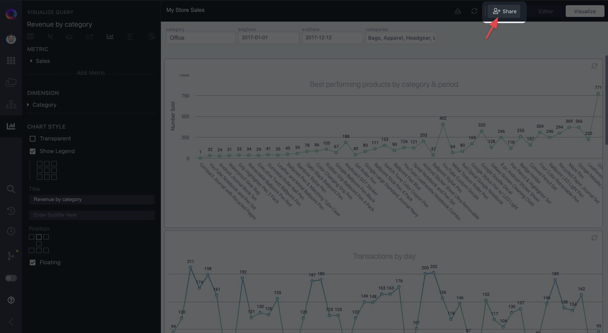
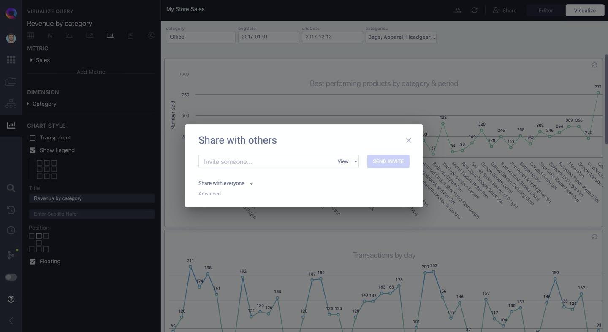

# Share Dashboards with colleagues

Once you've created and customized your dashboard, it's time to share it with others.

:::info
When you share a dashboard with someone, you're effectively sharing a Board with them.
:::

Click on the "Share" button to share your dashboard with other colleagues.

In the Share pop-up you have two options:

1. Manually invite users to view or edit the dashboard
2. Make the dashboard

Additionally, you may make

