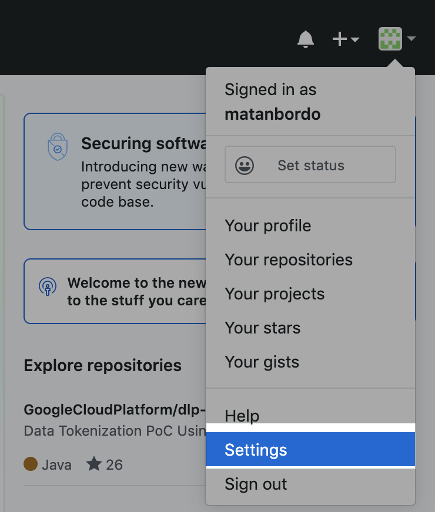
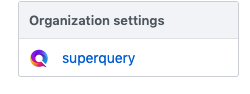
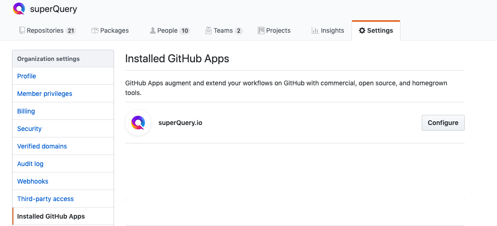
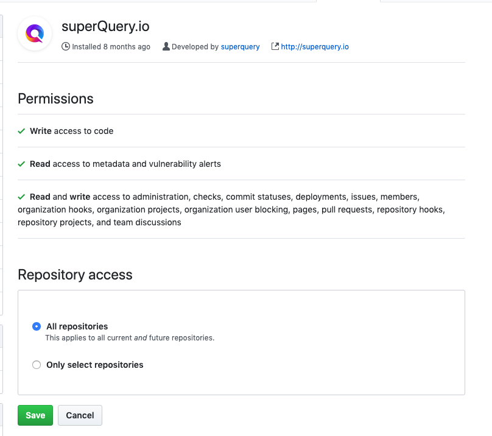

# Connecting your GitHub Organization to superQuery

:::info
This article is for those who are connecting superQuery to their GitHub Organization. If you'd like to connect to a personal repository instead, refer to [this post](connect-github.mdx).
:::

:::tip
**Only GitHub** [**Organization Owners**](https://help.github.com/en/articles/permission-levels-for-an-organization#permission-levels-for-an-organization) **have the permissions required to set up superQuery at the organization level.** If you're not an Owner, please share this post with an Owner on your team.
:::

In order for your team to connect superQuery to repos in your GitHub organization, you'll need to ensure all permissions are set for the superQuery GitHub application at the Organization level.

## Step #1: Access Organization settings

In GitHub, click on your profile icon and then on "**Settings**"

From there, go to "Organization Settings" on the left-hand menu and select your organization.

## Step #2: Access "Installed GitHub Apps"

Make sure that you see "superQuery.io" is installed. If it isn't please install it at the organization level by using [this link](https://github.com/apps/superQuery-io/installations/new).

## Step #3: Permit the repos that can be accessed

Click "**Configure**" next to "superQuery.io" and go to "**Repository access**" to determine which repos to permit for connection to superQuery.

## Step #4: Make sure superQuery application is permitted as a third-party app

Navigate to the "Third-party access" tab and double-check that the superQuery application is permitted.

