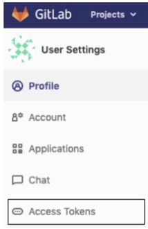
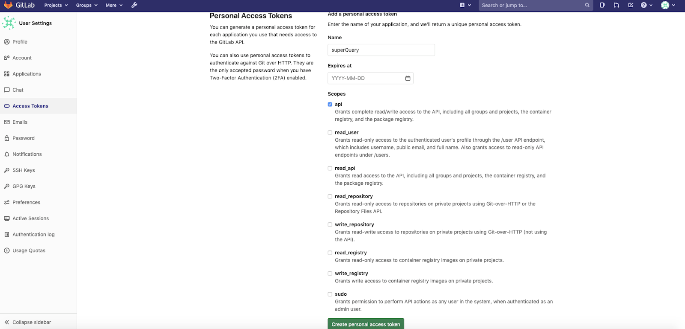
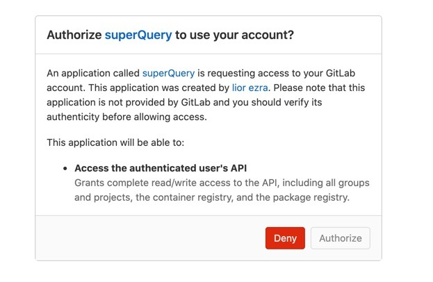
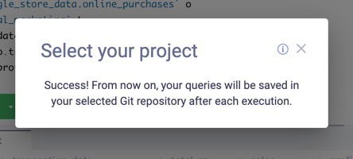
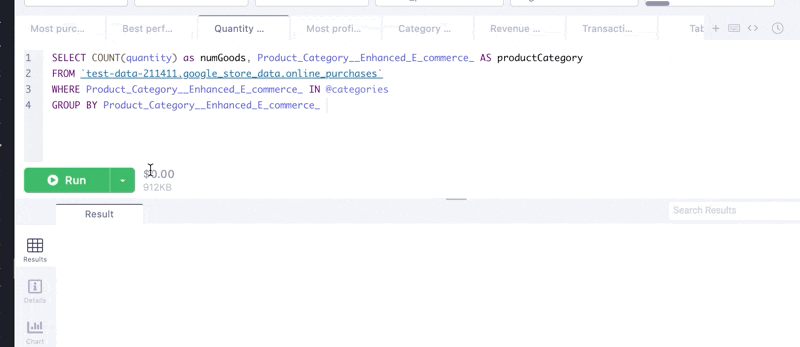
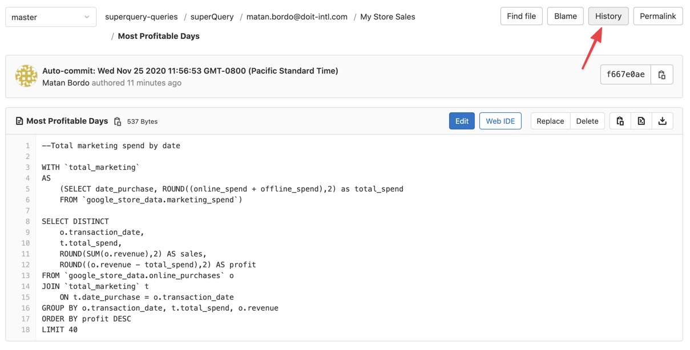
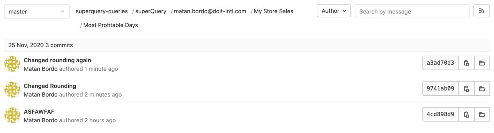
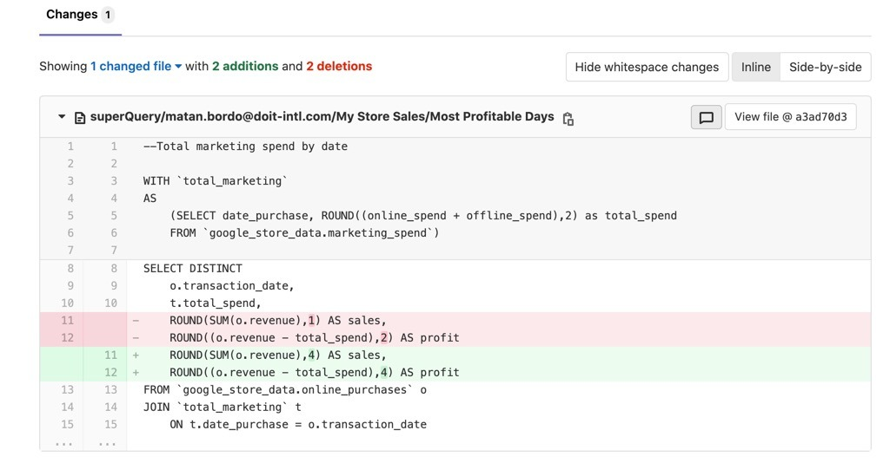

# Connect your GitLab project to superQuery

Have you ever written what you thought was a one-time query, only to have to re-create it from memory a few weeks later? Or have you ever found yourself needing a previous version of a query you wrote?

By connecting your GitLab project to superQuery, you'll effectively create a query library &mdash; a place for saving, updating, and tracking changes in your queries.

Let's see how to set this up below.

## Step #1: Authorize superQuery access to your GitLab account

Click on the "Source Control" icon in the lower-left corner of your navigation panel, and select "Connect to GitLab"

Next, choose your deployment option and click "**Connect**".

### Connecting to a self-hosted GitLab Instance

If you are connecting to a self-hosted GitLab instance, you will need two things:

* Host domain IP/DNS
* Personal Access token

To generate a Personal Access Token, sign in to your GitLab instance and go to Settings.

Next, select "Access Tokens" from the left-hand menu.

Name your token, set an expiration date if you'd like, and under "Scopes" select API.

Finally, click "Create personal access token" at the bottom, copy your token, and paste it into the "Access Token" text box in superQuery.

**Connecting to a GitLab-hosted instance**

After clicking "**Connect**", GitLab will open and request authorization for superQuery to use your account.

Once you see the message shown below, click "**Authorize**".

## Step #2: Select a GitLab project

:::note
This step is for users who connect to a GitLab-hosted project.
:::

Once you give authorization, the next step is to select the GitLab project you'd like to connect to.

A few seconds after selecting it, you should see a success message:

## Step #3: Run a query

Once your project is connected, you're all set to start committing queries to GitLab!

By default, your query tabs will have "Auto Commit" enabled in their [query tab settings](../superquery-editor/tab-settings.mdx#source-control).

This means that your queries will be committed to GitLab once executed, and assuming there were any changes made from the previous version. If no changes were made, your query will not be committed.

If you'd prefer to manually commit your query without having to execute the query, or want to add a commit message, then use the manual Commit option as shown below.

## Step #4: View your changes in GitLab

In GitLab, your queries are organized in your project under a pre-determined hierarchy of User > Board > Query Tab.

To see your changes in GitLab, find your query by clicking on:

1. **superQuery**, then
2. Your superQuery **username** (i.e. email address), then
3. The **Board** the query is in, and finally
4. The name of the **query tab**, you made the changes in.

For example, in our case the path would be **superquery-queries** \[project] > **superQuery > My Store Sales** \[Board name] > **Most Profitable Days** \[tab name].

Once arriving at the query tab you want to examine (in our case below, "Most Profitable Days"), you will see the last version committed to your GitLab project.

To view the history of changes and see what changes were made, click on "History"

You will be able to see your latest commits / changes made to that tab.

Finally, click on any of the messages to see the changes made in that commit.

