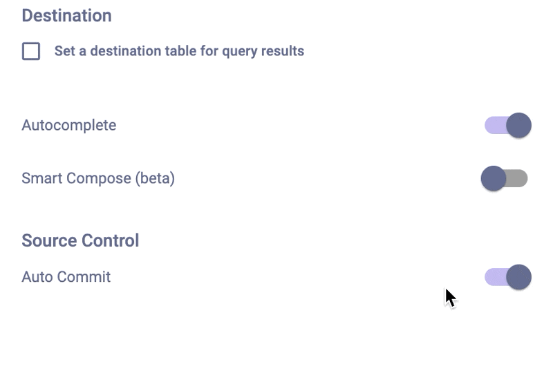

# Turning off Auto Commit for Git integrations

By default, after you connect your source control tool to superQuery, each query execution is automatically committed to your repository &mdash; as long as a change was made to the SQL from the previously-committed version.

However, there may be cases where you won't want each query execution to be committed to Github, and you may want to perform the equivalent of a [Git Ignore](https://www.toolsqa.com/git/git-ignore/).

To turn this off, first open your [Query Tab Settings](../superquery-editor/tab-settings.mdx).

Then, towards the bottom of your Query Tab Settings, click on the toggle next to "Auto Commit" to toggle it off.

