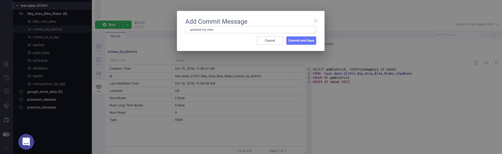

# Version control changes made to BigQuery views

## Commit Changes

To version-control changes made to BigQuery views, first, open the view you'd like to edit.

A preview should open in the lower-right of your screen. Inside of the preview itself, you may make your changes.

Once the changes are made, click on the "**Save and Commit**" button to commit the view to whichever source control tool you use.

Add a message to your commit to give more context to and your colleagues around the type of changes made.

Finally, click on Commit and Save to complete the workflow.

## How do I find my views?

In any tool, views are organized under a "views" folder. Let's look at GitHub for example:

To access the view and its versions from your repo, first select the project inside of the views folder which corresponds to the project your view is stored inside of. Then select the dataset which contains the view. Finally, select the view itself.

