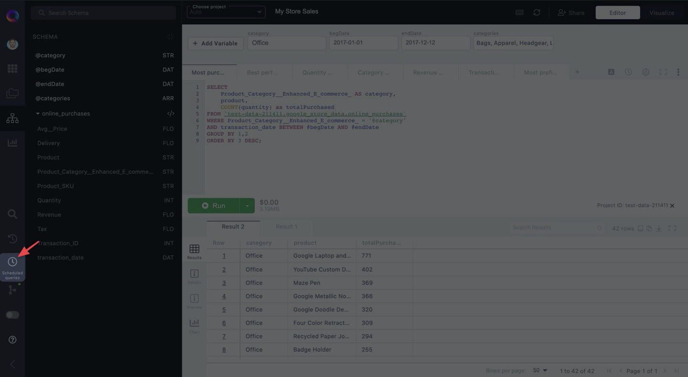
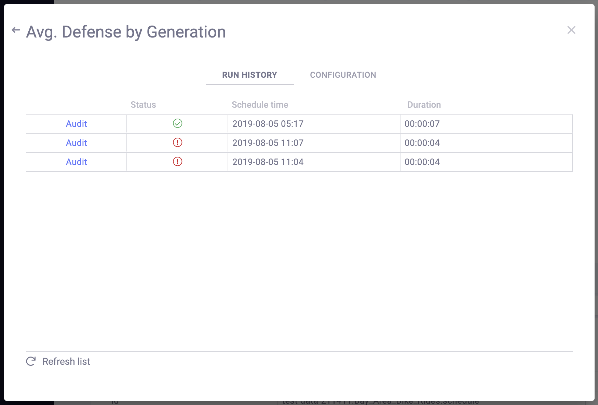

# Managing scheduled queries

To view and manage your scheduled queries, click on the Scheduled Queries icon in your left-hand resource panel.

## View scheduled queries

After clicking through, you will see all of your scheduled queries as well as some high-level information on each query.

This includes:

* **Query status** - lets you know whether the most recent scheduled job executed successfully or failed.
* **Summary** - if a query failed, this displays the reason why.
* **Cost**
* **Frequency** - how often the query will execute.
* **Destination Dataset** - the dataset in which the results of the scheduled query will be saved.

## Manage scheduled queries

By clicking on the **&vellip;** icon to the left of your query, you can manage your scheduled queries:

* **Run Now** - Execute the query immediately.
* **Open Query** - Open your scheduled query in a new tab.
* **Update Scheduled Query** - Open your Query Scheduler Settings for the selected query to make any changes.
* **Disable** - Stop your query from running as scheduled.
* **Delete** - Remove the query from your list of scheduled queries.

## Audit a scheduled query

Click on a scheduled query's name to view more details on its run history and configuration.

Under "**Run History**", you'll see a list of all previous executions of that scheduled job, including the time, duration, and status of that query.

Click on "**Audit**" next to a scheduled job to view the logs for that query.

Click on "**Configuration**" to view the query scheduler settings for that job.

This includes information such as the schedule interval, destination dataset, and the SQL itself.

