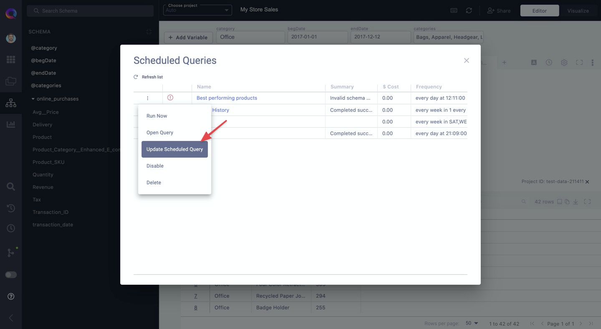
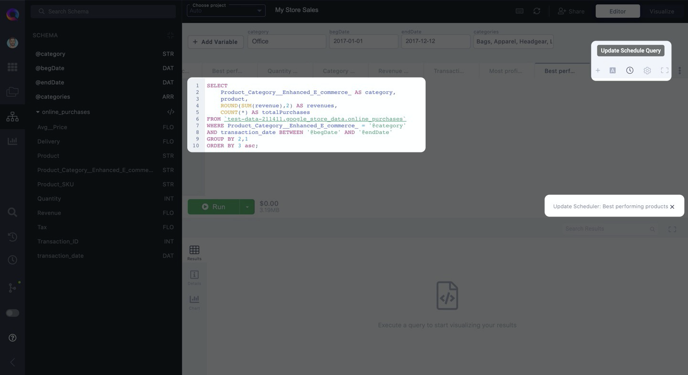

# Updating scheduled queries

Open your [Scheduled Queries Manager](managing-scheduled-queries.mdx) by clicking on the "Scheduled queries" icon in your left-hand resource panel. This is where you go to view, edit, and manage all of your scheduled queries.

Then, next to the scheduled query you want to update, click on the vertical ellipsis **&vellip;** and then "Update Scheduled Query".

After clicking "Update Scheduled Query", a slide-out will appear on the right side of your screen with your scheduled query's settings.

If the changes you need to make involves the scheduled query's interval, destination settings, or alerting, then make your changes here and click "Update" to update the scheduled query.

Additionally, a new query tab will open, containing the SQL of that scheduled query. If your change requires updating the underlying SQL of your scheduled query, then click "Cancel" in the slide-out and make the change in the newly-opened query tab.

After making your changes, click on the "Schedule Query" icon to bring back the slide-out. Finally, click on "Update" to make your changes final.

