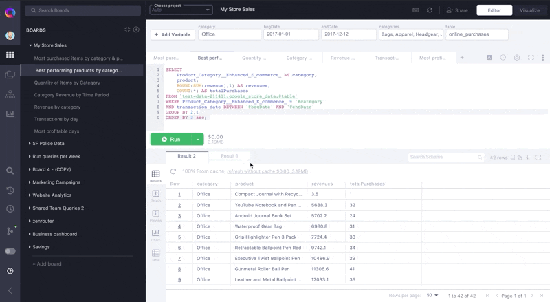

# Creating ad-hoc visualizations with Charts

Charts are great for when you want a quick look at query results in a non-table format.

Typically you might export your results to Google Sheets or your BI tool, but with superQuery Charts you can do this in one click without leaving the SQL editor.

Here's how to create a Chart:

1. Execute a query
2. Click on the "**Chart**" icon in your results grid.
3. Select your graph type in the left-hand resource panel.

