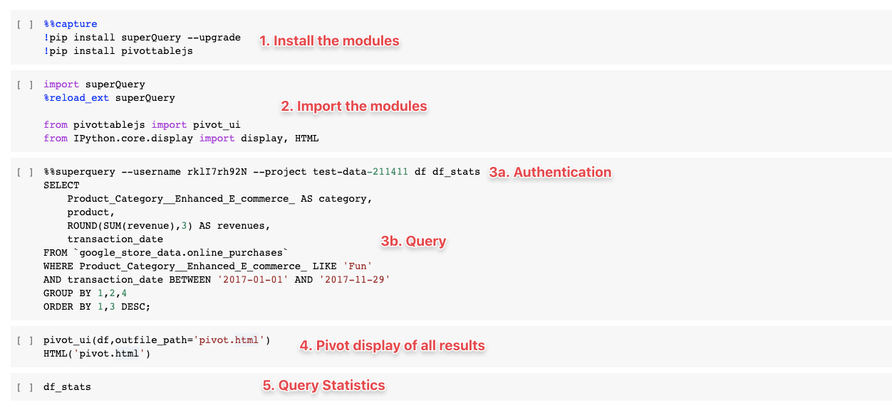
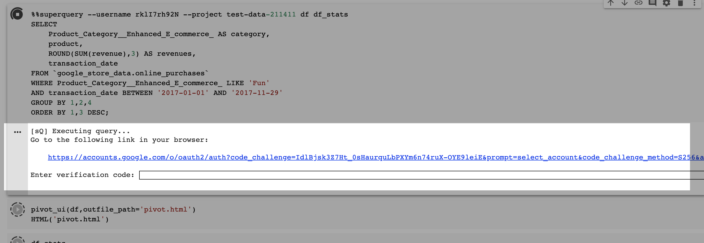

# Export your query to Google Colab

In this post, we'll go over how to seamlessly export your SQL to [Google Colab](https://colab.research.google.com), or to a .ipynb format.

If you're a data scientist, or just work with python in general, Jupyter Notebooks likely represent the hub where most of your work gets done.

[Google Colab](https://colab.research.google.com) is a free cloud service that provides a Jupyter notebook environment, and it requires no setup to use! Perfect for developing deep learning applications, ML education, or just to brush up on your Python skills.

With this trick, you will go from working on your query in superQuery to exploring it further in Colab with **zero copying and pasting.**

The initial process of setting up your connection to Google Colab goes as follows:

## Step 1: Export query results to Jupyter

After running a query, click on the "Export to Jupyter" icon that appears next to the row count for your results.

## Step 2: Add the Google Drive scope

If this is your first time, you'll be asked to add an auth scope for Google Drive. Because Colab works off of your Google Drive, superQuery requires your permission to access your Drive.

## Step 3: Review the permissions superQuery is requesting

Click "Allow" to give superQuery the requisite permissions.

## Step 4: Open your SQL in Colab

After authenticating and giving the requisite permissions, you will see a slide-out appear whenever you click on the "Export to Jupyter" button.

Click "Open" to open your query in a Google Colab notebook.

## Step 5: Explore your results in Colab

Colab will open with five pre-filled cells containing:

**1.** Code that installs the superQuery module to connect to our python library, [superPy](https://github.com/doitintl/superPy). There is also a module for pivot table view of your results.

**2.** Code that imports the modules.

**3a.** Authentication of your unique superQuery credentials.
**3b.** Your query, as it appeared in superQuery

:::note
If you had any [variables](variables.mdx) inserted, they will be converted back to their literal values here.
:::

**4.** A pivot display of your query results.

**5.** Statistics on your query such as cost, data scanned, or whether you received all or partial results from cache.

When running a query for the first time in Colab, you will be prompted to click a link and get a verification code.

After entering the verification code, you'll be able to explore your results in a pivot table and get various query statistics.

