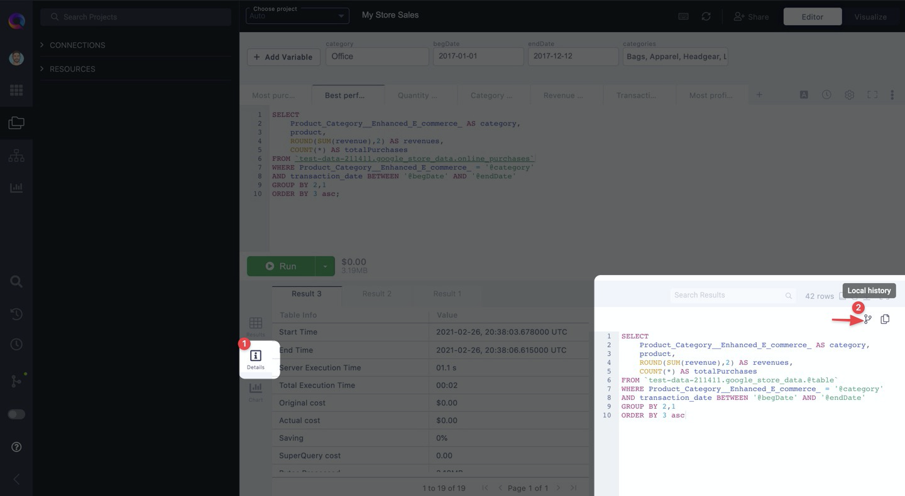

# Comparing different versions of a query with Local History

Local History allows you to compare versions of a query between different results for that [Query Tab](query-tabs.mdx). That way, it becomes easy to understand what changes were made.

:::note
You can only access different versions of your Query Tan in Local History for your current session.
:::

Similar to Git Diff functionality in source control tools, changes made between two versions of a query are highlighted for you to easily spot the difference.

For Local History to work, make sure you've run a query at least two times in a query tab, with modifications made to the SQL along the way.

Access Local History by clicking on the **\[1]** "Details" button in your results grid.

Then, click on the **\[2]** "Local History" button underneath the SQL preview for that result tab.

Finally, select which result's SQL you'd like to compare using the dropdown menus on either side of the Diff pop-up (first screenshot above).

