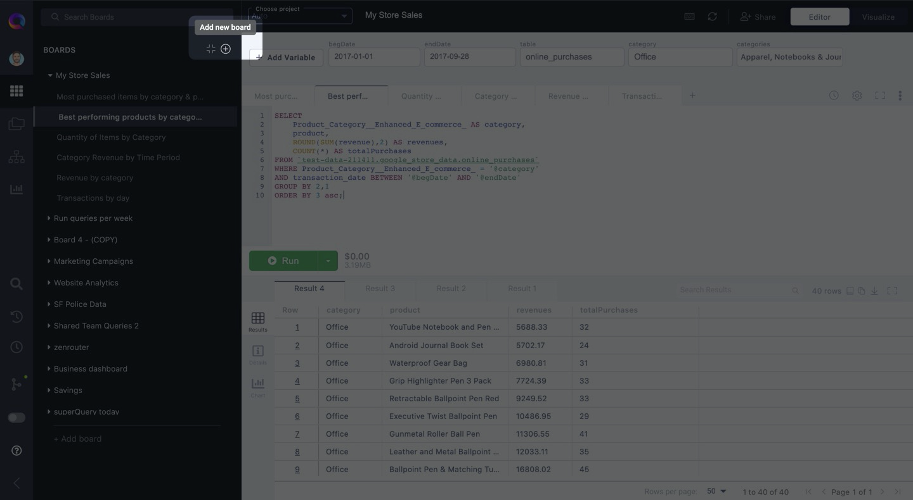

# Organizing Query Tabs with Boards

Boards are like folders for your [Query Tabs](query-tabs.mdx). Instead of saving all of your queries into one Saved Queries list &mdash; as you would in BigQuery &mdash; you can group tabs into multiple Boards.

## How should I use Boards?

Use boards to group related queries together.

For example, if you're exploring user metrics AND separately working on a personal project, you wouldn't place all those queries into one board.

As illustrated below, you would separate queries into "User Metrics" and "Personal Project" boards.

## How do I create and access my boards?

### Accessing Boards

Click on the **Boards** icon (shown below) in your Resource Panel to open a list of boards you've created.

### Create Boards

To create a new board, click on the "**+**" sign at the top of your boards list.

#### Give your Board a good name

After creating a Board, you'll want to give it a good name. Perhaps you intend on storing a queries which analyze your user behavior in a Board. In that case, you might call your Board "User Analytics", for example.

The point is &mdash; just like with naming [Query Tabs](query-tabs.mdx) &mdash; your Board's name should be **descriptive** enough that it is obvious where to find specific data and easy to identify which queries the board contains.

### Switch to another Board

Each board will have its name displayed, along with a dropdown list of all of the query tabs contained inside.

To switch to another Board, click on the name of a Board other than the one you currently have open.

#### Preview queries in another Board

If instead you want to preview queries in another Board without switching, expand a Board to view the queries inside by clicking the &#x25ba; icon.

Clicking on a query in the dropdown will open up a preview of its SQL in your results grid.

To share a Board, click on the Share button at the top of the people you want to share with, and select whether you want to give them View or Edit permissions.

* **View** allows recipients to view the SQL of all Query Tabs within a Board, and run the query, but they can't modify the queries. Additionally, queries are executed on the account of the Board creator.

* **Edit** permissions let users modify the SQL of a Board's Query Tabs, on top of everything else they can do with View permissions. Contrasting with View permissions, queries are instead executed on the account of the person actually running the query.

Finally, click "Send Invite" to share the tab. It will be accessible from the recipient(s) Board list, but only the tab(s) you share will be visible.

