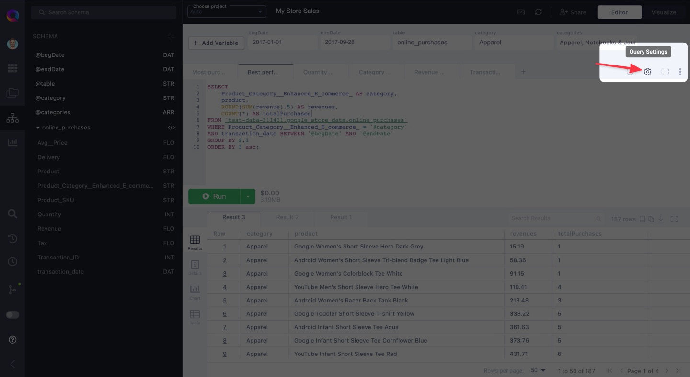
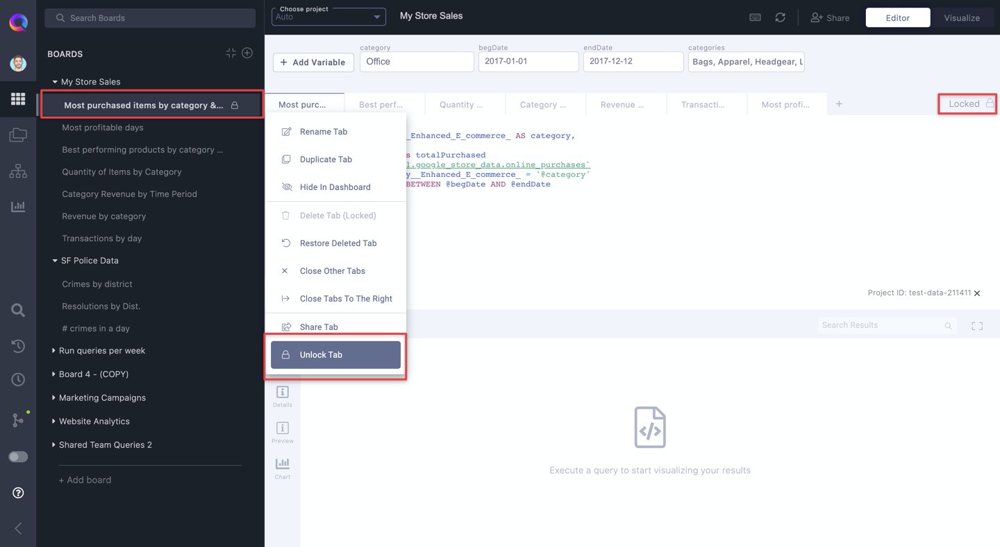

# Using Query Tabs

SuperQuery's Query Tabs allow you to work across multiple queries in one browser window. With Tabs, you can easily jump between queries you're working on.

## How do superQuery Query Tabs work?

### Your queries auto-save

The query (or queries) you write in a tab persist over time &mdash; meaning they'll never disappear unless you erase the SQL or delete the tab yourself. Much like working in a Google Doc, every change you make is auto-saved so you don't need to worry about losing your work if your browser crashes or you refresh your page.

### Results stay pinned to tabs

Query results stay pinned to their respective tab and are accessible for 24 hours, or for the duration of your session. Whichever is shorter.

Additionally, each query result is given its own tab, thus previous query results won't get erased. This saves you from having to re-run old queries whose results you want to take another look at.

### Run multiple queries in a tab

You can execute multiple queries in parallel inside a single tab while viewing each result separately. If you're executing a series of DML/DDL queries, we'll recognize that and run the queries sequentially, with each query building off the one preceding it.

## Creating a Query Tab

First, open the [Board](organizing-queries.mdx) you'd like to add the query tab to or create a new one. Then, click the "Add tab" button as shown below.

### Give your tab(s) a memorable name

Double-click on a tab to give it a new name. Your tab's name should be descriptive enough that it is obvious to you what you're querying if looking at the name alone.

### Tab Settings

Each tab has its own settings that you can edit. To make changes to your tab's settings, click the Settings gear icon as shown below.

For more information on your tab settings, read [**this article**](tab-settings.mdx).

## Tab Options

A set of options are available in each tab by clicking the vertical ellipsis **&vellip;** to the left of any query tab. Most are self-explanatory, but let's dive deeper into some of the often-used options.

### Closing and Deleting Tabs

Closing tabs hides it from your Editor, but it doesn't mean the tab is deleted. You can close tabs by clicking on the "x" that appears when hovering over a query tab, or via two tab options ("**Close Other Tabs**", "**Close Tabs To The Right**").

You can always bring it back to your editor view from your Boards list. Just click on the tab that was closed and it will resurface as a tab in your editor.

To permanently remove a query tab, open the options dropdown for that tab and click the "Delete Tab" option from the dropdown menu.

If you accidentally deleted a tab, you can restore it with the "Restore Deleted Tabs" option in the dropdown.

:::note
"Restore Deleted Tabs" will only restore tabs that were deleted in your current session.
:::

### Share Tab

"Share Tab" is perfect for when you want to collaborate on or share a specific tab in a Board, but not all of the tabs within that Board.

To share a tab, enter the email(s) of the people you want to share with, and select whether you want to give them View or Edit permissions.

* **View** allows recipients to view a query tab's SQL and run the query, but they can't modify the query. Additionally, the query is executed on the account of the Board creator.

* **Edit** permissions let users modify the SQL on top of everything else they can do with View permissions. Contrasting with View permissions, the query is instead executed on the account of the person actually running the query.

Finally, click "Send Invite" to share the tab. It will be accessible from the recipient(s) Board list, but only the tab(s) you share will be visible.

### Lock Tab

The "Lock Tab" functionality makes the selected query tab uneditable to everyone &mdash; as if you're seeing the query from the perspective of someone with "View" permissions.

When a tab is locked, you will see a lock icon next to its name in your Board's list. Additionally, locked tabs have a "Locked" message display towards the top-right corner of your editor.

To unlock a tab, click on "Unlock Tab" from your tab options dropdown or click on the "Locked" message at the top-right of your editor.

