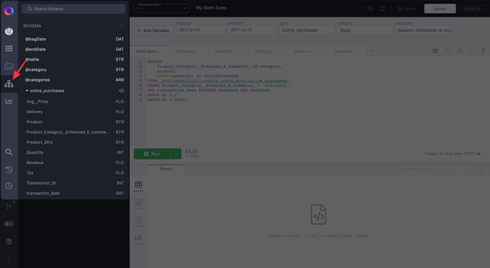
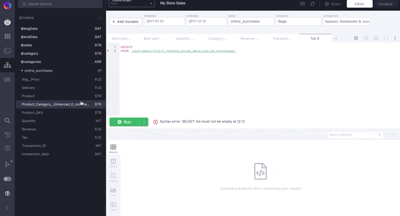

# Accessing your table schema

The schema tab displays the columns of the table(s) being queried in your active query tab. If you have **variables** set up, those will show up as well.

Your table's schema is automatically detected from your SQL. Once dataset and table is entered into your SQL, that table's information will be available for you in the Schema tab.

Access the Schema tab via the left-hand resource panel.

## Interacting with Schema

Click on the columns in the Schema tab to place them inside your query. superQuery will recognize whether a column is the first in a list, or whether it follows a column. In the latter case, we will add a comma preceding

## Viewing multiple schemas

The Schema tab displays the schema for _all_ tables that are referenced in your Query Tab.

For example, when your tab contains multiple queries, or you're querying multiple tables in a query (ex. JOINs).

