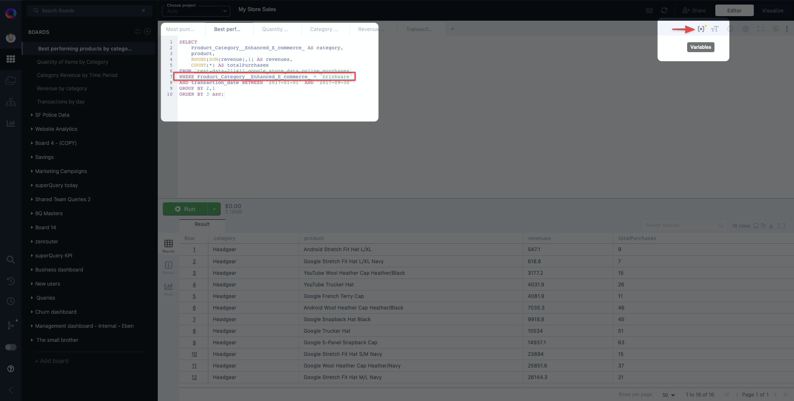
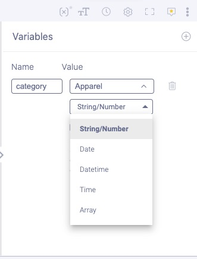
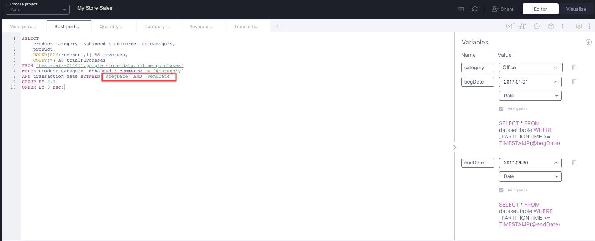
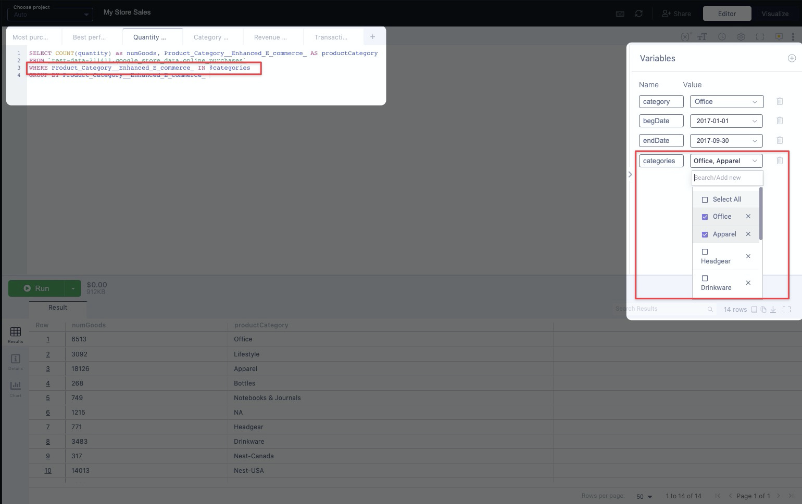
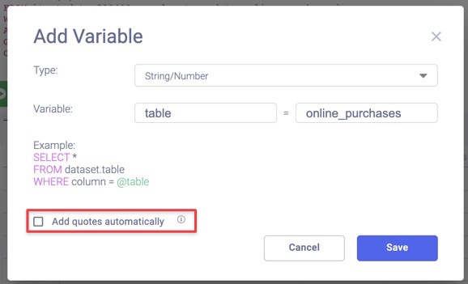

# Writing dynamic queries with Variables

How much time do you spend repeatedly making small changes to your SQL?

When you find yourself constantly updating a WHERE clause in your query, then it's time to insert **variables** into your SQL.

## What are variables?

Variables (sometimes called parameters) are placeholders for values that can change in your SQL.

They make your queries more readable and allow you to perform quick changes on your query without modifying the SQL itself.

The best part? You can create and modify them in superQuery without using any SQL! No DECLARE or SET clauses required.

## Creating Variables in superQuery

### Step 1: Open the Variables side panel

In the example below, our query is finding the best-performing products for an eCommerce store, for a given category. Currently, the query is examining the "Drinkware" category.

Let's see how variables can help us here.

Click on the **(x) icon** to open the variables side panel and create your first variable.



Then click on the purple "**Add a variable**" button or the **"+"** Add Variable button to create a new variable.


### Step 2a: Give your variable a good name and initial value

Since we're exploring categories in our example, we will name our variable "**category**", and give it an initial value of "**Apparel**" in order to explore a different category.


### Step 2b: Select your variable's data type

<!-- textlint-disable max-comma -->
Variables can hold the following data types: String, Number, Date, Datetime, Time, and Array.
<!-- textlint-enable -->

In our example with the variable representing a product category, we will make our variable a String.

:::tip
When creating a new variable, the data type dropdown will be visible by default. If you want to hide it, click on the "^" button next to the value. Similarly, click on the "v" button to un-collapse it and show the data type dropdown.
:::



### Step 3: Insert your variable into a query

Once created, insert your variable into your variable by replacing a field with it.

To use a variable in your SQL, place an **'@'** character in front of the variable's name, like the example below.

In our case, we'll replace "Drinkware" with a variable named "category" that currently holds a value of "Apparel"


## Editing your variable's value

There will be cases when you'll want to change your variable's value. For example, we might want to switch our variable's value from "**Apparel**" to "**Office**".

To edit your variable's value, simply update the text box corresponding to the variable.

Then re-run the query to have your results reflect the change in variable value, as shown below.


## Other use cases for variables

### Dates and Date Ranges

Beyond replacing numbers and strings, variables are great for holding date values &mdash; perfect if you're modifying date ranges, as we'll see below.

Using our previous example, we can replace the date range referred to in line 8 below with two variables

```sql
SELECT
  ProductCategory__Enhanced_E_commerce AS category,
  product,
  ROUND(SUM(revenue),1) AS revenues,
  COUNT(*) AS totalPurchases
FROM test-data-211411.google_store_data.online_purchases
WHERE ProductCategory__Enhanced_E_commerce = '@category'
AND transaction_date BETWEEN '2017-01-01' AND '2017-09-30'
GROUP BY 2,1
ORDER BY 3 asc;
```

First, we'll create two Date variables called "begDate" and "endDate" which hold the values "2017-01-01" and "2017-09-30", respectively.


Then insert the two variables in place of the date values that were originally there.



### Arrays

Arrays are multi-value columns in BigQuery, where an array field contains more than one value (of the same data type). You can create variables that contain arrays, and from there, "check" which fields you'd like to include in your query, as shown below.

You can then use your array variable in your queries &mdash; specifically after the IN clause.

To create an Array variable, after selecting the Array data type, enter all of the possible values your array will hold.



You can then modify the values the Array holds by checking the boxes next to fields you want or don't want to include, then re-run the query:


### Table & Dataset names and Partitioned Table suffixes

Variables are great for replacing table and dataset names in cases where you find yourself modifying table names a lot. Additionally, if you are constantly changing the date portion of a date-partitioned table, variables make it much easier to do that.

First, create a string variable and uncheck the "**Add quotes automatically**" box. This will let us use our variable between the tick marks where you'd typically write `project.dataset.table`.

In our example below, we're creating a variable called "table" that holds the value of our table "online_purchases".



Finally replace the table name in your query with your variable, in our case "@table".


That's it! The same thing works for datasets and date-partitioned tables. For the latter, you'd create a string variable that contains the date suffix, for example "20200225" and insert the variable _after_ the table name like below:

`project.dataset.table@suffix`

## Watch Variables in action

Watch our 3-minute variables tutorial below:

<div style={{position: 'relative', 'padding-bottom': '56.25%', 'height': 0}}><iframe src="https://www.loom.com/embed/1c9cb4b255914817b095295a83971275" frameborder="0" webkitallowfullscreen mozallowfullscreen allowfullscreen style={{position: 'absolute', 'top': 0, 'left': 0, 'width': '100%', 'height': '100%'}}></iframe></div>
