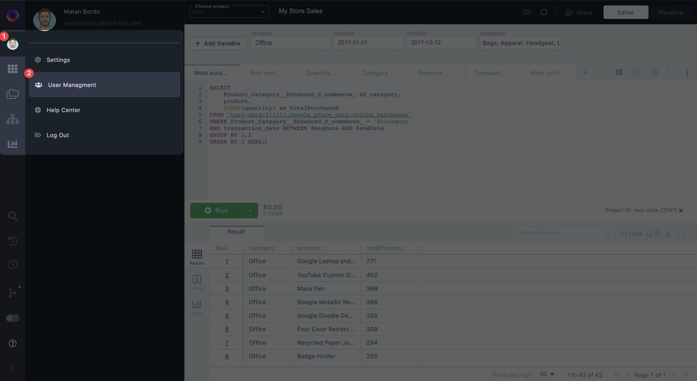
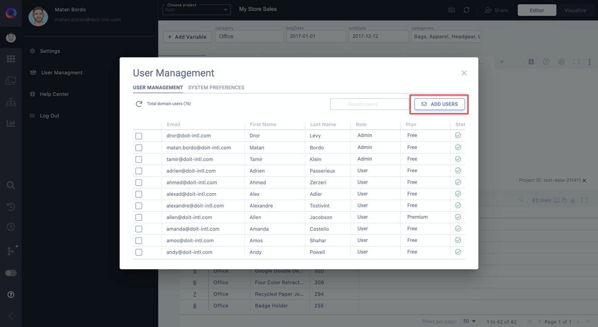
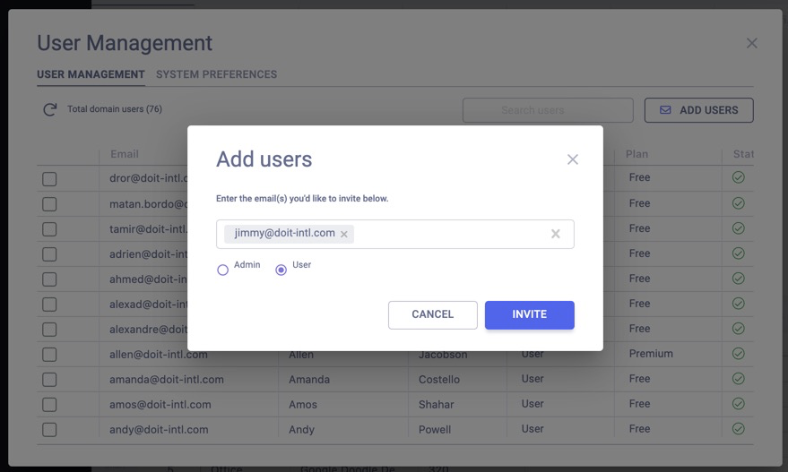
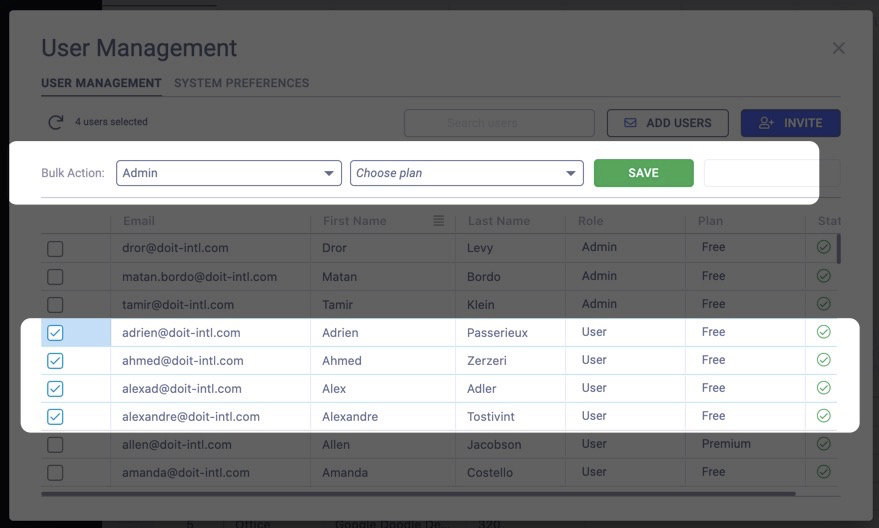

# Set up and manage your team

superQuery lets you create and manage your team so you can:

1. Add colleagues to your team.
2. Assign roles on the team.
3. Manage who can set up Team Caching, connect to Google Cloud Storage, and more.

To access your Team Manager, click on your profile in the left-hand resource panel. Then click on "**User Management**".

## Add teammates

Click the "**Add Users**" button to invite colleagues to your team.

Enter the email(s) of the colleagues you want to invite. Then select whether you'd like them to be an **Admin** or a **User** on your team.

### Team Roles

There are two possible roles on a team in superQuery:

* Admin
* User

#### **Admin role**

People with an Admin role can:

* Invite people to your team
* Assign roles
* Determine which users are on a premium plan vs. free plan.
* Set up Team Caching for DynamoDB or Firebase
* Connect their team's GCS bucket to superQuery

#### User role

Users can use superQuery as normal, minus the Admin capabilities mentioned above.

### Assigning roles

You can assign roles to team members in two ways:

1. Assign a role when inviting them to your team, as shown above.
2. Edit their role from the User Management screen.

To edit a team member's role from the User Management pop-up, find the user and click on the dropdown for the "**Role**" column.

Then select which role you'd like them to have.

### Bulk Editing

Bulk editing allows you to change the roles & plans of multiple users in a single action.

It also allows you to re-invite users to your team in case they missed your invitation. To perform a bulk edit, select the checkbox next to the users whose role and/or plan you'd like to modify.

From there, select the type of role and/or plan you'd like to assign to them and click "**Save**" when finished.

