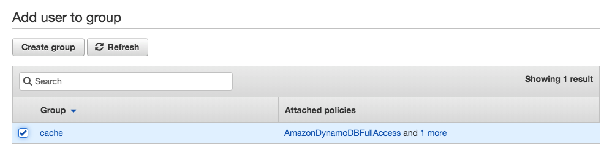
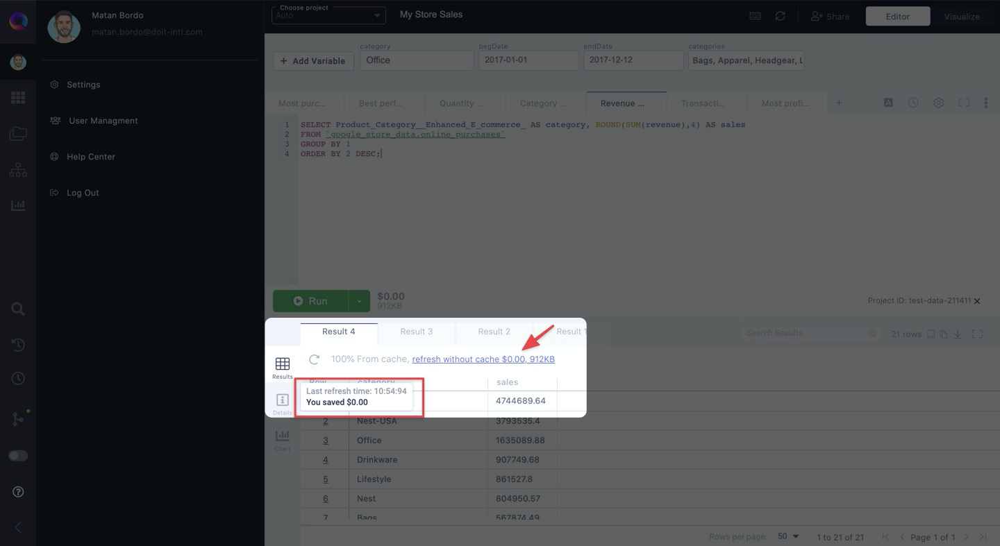

# Set up Team Caching with DynamoDB

**Team caching** enables you to share a cache across your team. That way, if you run a query that a colleague executed earlier in the day, you will have the option to quickly pull their results from cache.

This post goes over how to set up the cache to be stored on your DynamoDB.

## Get Access Key and Secret Key

Log in to your AWS console and open AWS's IAM service.

Then add a user to a group that has DynamoDB access. This is for you to manage the user that has access to your team's cache table.

Make sure that the group you're adding the user to is allowed access to DynamoDB.

At the end of the process, you will have your access key and secret key. Save both for the next step.

## Set your DynamoDB credentials in superQuery

Open superQuery and click on your Profile icon in the Resource Panel. Then, click on "**Settings**".

Under "**Team Caching**" click the "Private" button and set your database to "AWS &mdash; DynamoDB".

Then click on "Set credentials" to enter your DynamoDB details. Copy and paste your access key and secret key from earlier. Then name your connection and select your database region(s).

## Activate Team Caching

Finally, execute any query twice in a row to activate team caching.

Once you've done that, a cache table called "superQueryCache" will be available in the Firebase database you connected to.

Your query's results will come from cache when you see "**100% saved**" next to your query's cost in the dry run, like below.

If results come from cache, you will see a message appear above your results like below. If you wish to generate fresh results not from cache, click on **refresh without cache** in your results tab. Hovering over the message will also show the "Last refresh time", which tells you how fresh the data is.

